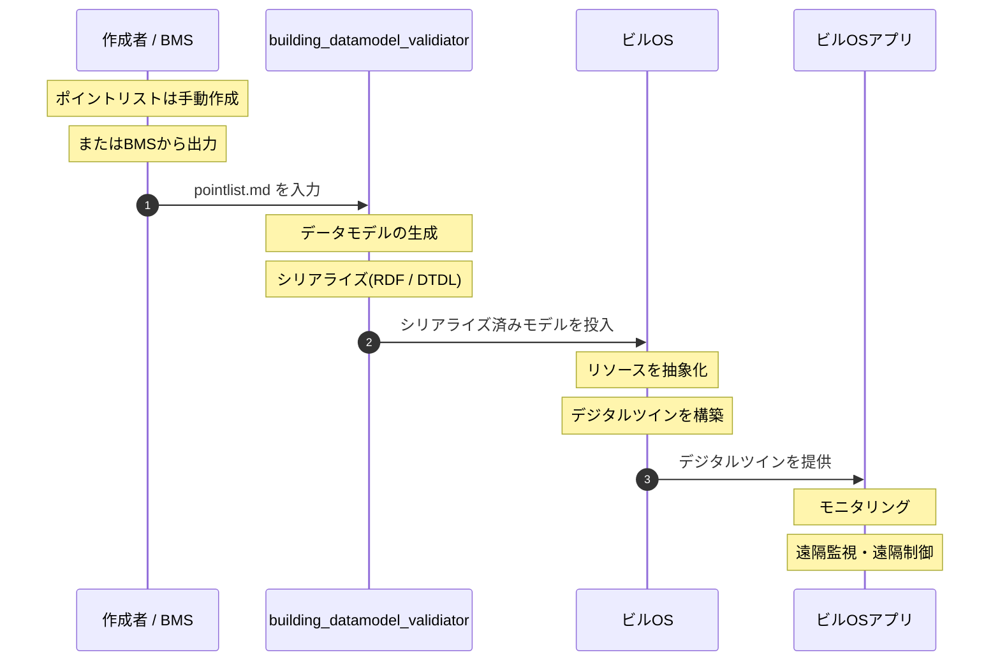

# スマートビルにおけるデータ生成と利活用のフロー

## 目的
pointlist.md のポイントリストを起点に、データモデルの生成からビルOSでの利活用までの流れを整理する。

## 全体像
1. `pointlist.md` に基づき、設備・ポイント・空間などの要素を定義する。
2. `building_datamodel_validiator` がデータモデルを生成・修正・出力し、必要な検証も行う。
3. 生成されたデータモデルを RDF や DTDL などにシリアライズする。
4. シリアライズしたモデルをビルOSと呼ぶプラットフォームに入力する。
5. ビルOS上で建物のリソースが抽象化され、デジタルツインが構築される。
6. デジタルツインを介してモニタリングと遠隔制御が可能になる。

## 役割整理
- `pointlist.md`
- 入力となるポイント定義の基準
- 設備、ポイント、位置情報、タグ、単位などを提供

- `building_datamodel_validiator`
- データモデルの生成・修正・出力
- 生成結果の検証
- RDF / DTDL などの出力を支援

- ビルOSプラットフォーム
- シリアライズ済みモデルの受け入れ
- リソースの抽象化
- デジタルツインによる運用

## プロセスフロー

## メモ
- モデルの変更や追記は `building_datamodel_validiator` で一貫して行う。
- シリアライズ形式は用途に応じて選択し、ビルOS側の受け入れ仕様に合わせる。
